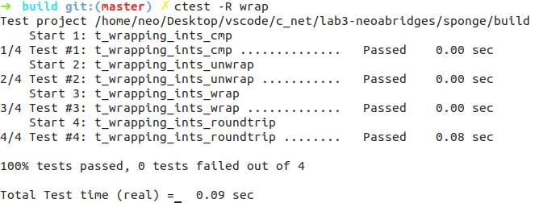
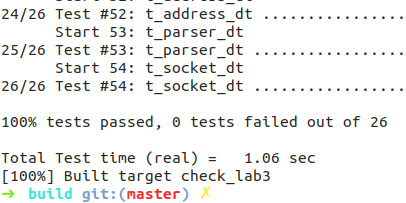

Lab 3 Writeup
=============

My name: [<font color="purple">刘轩昂</font>]

My Student number : [<font color="purple">201220198</font>]

This lab took me about [5] hours to do. I [did] attend the lab session.

### 1. Program Structure and Design:

1. 需要实现序列号、绝对序列号和stream索引的解释和转换方法`wrap()`和`unwrap()`

2. 完成`TCP reciever`

### 2. Implementation:

- 实现`wrap()`和`unwrap()`： <br>
对于`wrap()`，直接相加； <br>
``` cpp
// wrapping_integers.cc
WrappingInt32 wrap(uint64_t n, WrappingInt32 isn) {
    return WrappingInt32{static_cast<uint32_t>(n) +isn.raw_value()};
}
```
而对于`unwrap()`，需要引入`checkpoint`来进行判断： <br>
``` cpp
uint64_t unwrap(WrappingInt32 n, WrappingInt32 isn, uint64_t checkpoint) {
    int32_t offset = n - wrap(checkpoint, isn);
    int64_t s = offset + checkpoint; // 
    if (s >= 0) {return static_cast<uint64_t>(s);}
    else {return s + (1ul << 32);}
}
```
- TCP receiver
``` cpp
void TCPReceiver::segment_received(const TCPSegment &seg) {
    if (seg.header().syn || _isn != nullopt){
        if (seg.header().syn) _isn = seg.header().seqno;
        // unwrap
        uint64_t absSeq = unwrap(seg.header().seqno + static_cast<int>(seg.header().syn), _isn.value(), _checkpoint);
        _reassembler.push_substring(seg.payload().copy(), absSeq-1, seg.header().fin); // stream indices = absSeq-1
        _checkpoint += seg.length_in_sequence_space(); //更新checkpoint
    }
}
optional<WrappingInt32> TCPReceiver::ackno() const { 
    if (_isn == nullopt) return nullopt; 
    return wrap(stream_out().bytes_written() + stream_out().input_ended() + 1,  _isn.value());
}
size_t TCPReceiver::window_size() const { return _capacity - stream_out().buffer_size(); }
```
### 3. Test:





